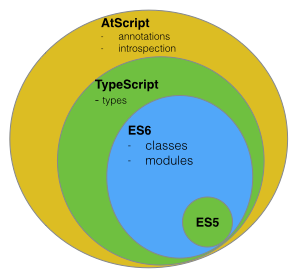
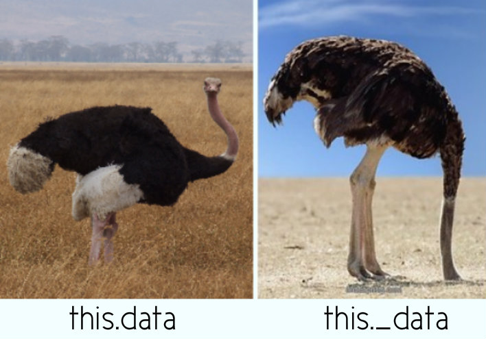

class: center, bottom
background-image: url(images/angular2.jpg)

##Plus qu'une simple évolution
---

# Programme
- Introduction
- ECMAScript 6
- TypeScript
- Angular2


---
# Angular 2 

est conçu pour:
- ECMAScript 6
- Web Components
- Mobile First

---
background-image: url(images/es6.jpg)


---

# ECMAScript 6

Nommée aussi ES2015 publié en Juin 2015

- Class
- Constantes
- Arrow functions
- Générateurs
- Paramètres par défaut
- ...

.center[http://es6-features.org/]

???
Implémentation progressive des navigateurs

---
## Let
- est une variable
- evite le hoisting ("remontée"), proté du bloc

``` javascript
function getPonyFullName(pony) {
  if (pony.isChampion) {
    var name = 'Champion ' + pony.name;
    return name;
  }
  return pony.name;
}
```
--

``` javascript
function getPonyFullName(pony) {
  var name;
  if (pony.isChampion) {
    name = 'Champion ' + pony.name;
    return name;
  }
  // name is still accessible here
  return pony.name;
}
```

---
## Let

- remplacer définitivement **var** à long terme

``` javascript
function getPonyFullName(pony) {
  if (pony.isChampion) {
    let name = 'Champion ' + pony.name;
    return name;
  }
  // name is not accessible here
  return pony.name;
}
```
???
sinon il y a un default dans le code

---
## Const

- est une constante 
- proté du bloc comme let
- uniquement en get

``` javascript
const PONIES_IN_RACE = 6;
PONIES_IN_RACE = 7; // SyntaxError
```
- Update attribut de l'objet ou tableau

``` javascript
//Objet
const PONY = {};
PONY.color = 'blue'; // works
PONY = {color: 'blue'}; // SyntaxError
//Array
const PONIES = [];
PONIES.push({ color: 'blue' }); // works
PONIES = []; // SyntaxError
```

---
## Affectations déstructurées
- nouveau raccourci pour créer des objets
- propriété de l’objet = nom que la variable

#### ES5
``` javascript
function createPony() {
  let name = 'Rainbow Dash';
  let color = 'blue';
  return { name: name, color: color };//ES5
}
```
--
#### ES6
``` javascript
function createPony() {
  let name = 'Rainbow Dash';
  let color = 'blue';
  return { name, color };//ES6
}
```

---
## Affectations déstructurées

raccourci pour affecter des variables à partir d’objets ou de tableaux
#### ES5
``` javascript
var httpOptions = { timeout: 2000, isCache: true };
// later
var httpTimeout = httpOptions.timeout;
var httpCache = httpOptions.isCache;
```
--
#### ES6
``` javascript
let httpOptions = { timeout: 2000, isCache: true };
// later
let { timeout: httpTimeout, isCache: httpCache } = httpOptions;
//OR
let { timeout, isCache } = httpOptions;
// you now have a variable named 'timeout'
// and one named 'isCache' with correct values
//Whit an Array
let timeouts = [1000, 2000, 3000];
// later
let [shortTimeout, mediumTimeout] = timeouts;
```

---
## Affectations déstructurées
#### Dans la vrai vie
``` javascript
function randomPonyInRace() {
  let pony = { name: 'Rainbow Dash' };
  let position = 2;
  // ...
  return { pony, position };
}

let { position, pony } = randomPonyInRace();

let { pony } = randomPonyInRace();
```
???
Cette fonctionnalité est pratique pour déclarer plusieurs variables à partir d’un objet retourné par une fonction.

---
## Paramètres optionnels

#### ES5
``` javascript
function getPonies(size, page) {
  size = size || 10; 
  //si l’opérande de gauche est falsy, 
  //c’est-à-dire undefined, 0, false, "",
  page = page || 1;
  // ...
  server.get(size, page);
}
```
--
#### ES6
``` javascript
function getPonies(size = 10, page = 1) {
  // ...
  server.get(size, page);
}
function getPonies(size = defaultSize(), page = 1) {
  //Can call a function
}
function getPonies(size = defaultSize(), page = size - 1) {
  //Can use previous parameters
}
```
???
Maintenant 0 ou "" sont des valeurs valides, et ne seront pas remplacées par les valeurs par défaut, comme size = size || 10 l’aurait fait. C’est donc plutôt équivalent à size = size === undefined ? 10: size;

---
## Paramètres optionnels
Fonctionne aussi pour les objets
``` javascript
let { timeout = 1000 } = httpOptions;
// you now have a variable named 'timeout',
// with the value of 'httpOptions.timeout' if it exists
// or 1000 if not
```

---
##Rest operator

Permet d'utiliser la liste des argusments **proprement**
#### ES5
``` javascript
function addPonies(ponies) {
  for (var i = 0; i < arguments.length; i++) {
    poniesInRace.push(arguments[i]);
  }
}

addPonies('Rainbow Dash', 'Pinkie Pie');
```
--
#### ES6
``` javascript
function addPonies(...ponies) {
  for (let pony of ponies) {
    poniesInRace.push(pony);
  }
}
```

*Ne pas confonfondre avec spread operator ("opérateur d’étalement")*

`let minPrice = Math.min(...[12,3,5]);`
???
ES5: 
 le paramètre ponies n’est jamais utilisé, et rien n’indique que l’on peut fournir plusieurs poneys.

ES6:
for …​ of utilisée pour l’itération est aussi une nouveauté d’ES6. Elle permet d’être sûr de n’itérer que sur les valeurs de la collection, et non pas sur ses propriétés comme for …​ in

---

## Classes

- Constructeur 
- toString() 


``` javascript
class Pony {
  constructor(color) {
    this.color = color;
  }

  toString() {
    return `${this.color} pony`;
    // see that? It is another cool feature of ES6,
    // called template literals
    // we'll talk about these quickly!
  }
}

let bluePony = new Pony('blue');
console.log(bluePony.toString()); // blue pony
```
???
Les littéraux de gabarits de caractères sont délimités par des accents graves seuls (backticks) (\` \`)  et non avec des doubles ou simples quotes. Les templates de gabarits peuvent contenir des éléments de substitution (placeholders). Ceux-ci sont indiqués par le signe dollar ($) et des accolades : ${expression}. 

---
## Classes

- propriété statique
- getter et setter

``` javascript
class Pony {
  static defaultSpeed() {
    return 10;
  }

  get color() {
    console.log('get color');
    return this._color;
  }

  set color(newColor) {
    console.log(`set color ${newColor}`);
    this._color = newColor;
  }
}
//...
let speed = Pony.defaultSpeed();//Use static

let pony = new Pony();
pony.color = 'red';// 'set color red'
console.log(pony.color);
```


---
## Classes

- héritage ~~prototypal~~
- héritage de classes 

``` javascript
class Animal {
  constructor(speed) {
    this.speed = speed;
  }

  doSomethink(){
  	//move, stop...
  }
}
class Pony extends Animal {
  constructor(speed, color) {
    super(speed);
    this.color = color;
  }
  doSomethink(){
  	//Override function
  }
}
let pony = new Pony(20, 'blue');
console.log(pony.speed); // 20
```

---
## Promise

.center[Similaire à Angular 1]

- Permet de gérer l'asynchone
- Plus lisible que les callbacks

Avec les callback
``` javascript
getUser(login, function (user) {
  getRights(user, function (rights) {
    updateMenu(rights);
  });
});
```
Avec les promises
``` javascript

getUser(login)
  .then(function (user) {
    return getRights(user);
  })
  .then(function (rights) {
    updateMenu(rights);
  })
```

---

## Promise

Expose une méthode `then` et `catch` 

``` javascript
asynchoneFunction().then(siSucces, siRejetée);
asynchoneFunction().catch(siRejetée); //= .then(undefined, siRejetée)
```

3 états:
Pending (en cours), fulfilled (réalisée), rejected (rejetée)
### Construstion d'une promise

Nouvelle class Promise

``` javascript
let getUser = function (login) {
  return new Promise(function (resolve, reject) {
    // async stuff, like fetching users from server, 
    //returning a response
    if (response.status === 200) {
      resolve(response.data);
    } else {
      reject('No user');
    }
  });
};
```

???
catch permet de gérer un reject sur une chaine de promise

nouvelle façon d’écrire des APIs, et toutes les bibliothèques vont bientôt les utiliser

---

## Arrow functions

- arrow function `=>`
- utile pour les callbacks et les fonctions anonymes
- return est implicite s’il n’y a pas de bloc
- le this **reste attaché** lexicalement

``` javascript
getUser(login)
	.then(user => {
		console.log(user);
		return getRights(user);
	})
	.then(rights => updateMenu(rights))
```

???
le this reste le this de la function parent

---

## Modules
Avant:
- CommonJS (NodeJS) avec une **syntaxe simple**
- RequiereJS (AMD) pour le **chargement Asynchrone**

--

Dans races_service.js
``` javascript
export function bet(race, pony) {
  // ...
}
export function start(race) {
  // ...
}
```
Dans otherFile.js
``` javascript
import { bet, start } from './races_service';
// later
bet(race, pony1);
start(race);
```

 .center[**Fondamentale dans Angular 2**]

???
API AMD (Asynchronous Module Definition)

---

## Modules
- Utilisation d'un alias
- Joker `*`

``` javascript
import * as racesService from './races_service';
//later
racesService.bet(race, pony1);
racesService.start(race);
```

- Exporter un seul élément (function, valeurn classe) : `default`

``` javascript
// pony.js
export default class Pony {
}
// races_service.js
import Pony from './pony';
```

???

---


# Et les vieux navigateurs?

.center[[Tester la comptibilité ES6: http://kangax.github.io/compat-table/es6/](http://kangax.github.io/compat-table/es6/)]

## Transpileur
.center[Ecrire ES6, convertir en ES5]

- [Traceur](https://github.com/google/traceur-compiler) by Google
- [BabelJs](https://babeljs.io/) by Sebastian McKenzie

???

Sebastian McKenzie avait 17 ans
 
Babeljs produit un code source plus lisible que Traceur

Angular 2 était d’ailleurs transpilé avec Traceur, avant de basculer en  TypeScript

---
class: center
# Conclusion

Faite du ES6 et un coup de transpileur dans votre processus de build.

---
background-image: url(images/typescript.jpg)

---

# Typescript

Typescript:
- permet le typage de javascript
- est un projet de Microsoft (2012)
- communauté active

Côté Google
- DartJS
- AtScript pour ajouter des annotations

.center[]

???
Avec la mise a disposition de TypeScript (open source), la version 1.5 (en 2015) contient les fonctionnalité d'AtScript, qui a été abandonné.

---
# Typescript

Après la fusion d'AtScript et TypeScript

.center[]

---
# Typescript

- Extension `.ts` (par convention) ou `.tsx` pour du ReactJS
- Compiler en javascript standard (ES3, ES5, ES2015)
- Code généré est très lisible

## Install

```Bash
npm install -g typescript
```
## Compile
```Bash
tsc test.ts
#sous windows 7:
tsc.cmd test.ts 
```

---

## Typage
`let variable: type;`

- Basics: boolean, number, string, array
- Autres: any, Class, Enum ,Tuple, Void
- Mix: number|boolean
- Les basics peuvent être définit à l'initialisation

``` typescript
let isDone: boolean = false;
let name = "Toto" //name:string
let users: Array<User> = [new User()];
// Declare a tuple type
let x: [string, number];
x = ["hello", 10]; // OK

enum Color {Red, Green, Yellow};
let c: Color = Color.Green; // c = 0

function setAfk(user: User): User {
  user.status = Color.Yellow;
  return user;
}

function setOnline(user: User): void {
  user.status = Color.Green;
}

```

---

## Interfaces

Continuer d'utiliser la nature dynamique de javascript.

Exemple :
``` javascript
function addPointsToScore(player, points) {
  player.score += points;
}
```

Avec TypeScript
``` typescript
function addPointsToScore(player: { score: number; }, points: number): void {
  player.score += points;
}
```
Ou en la nommant
``` typescript
interface HasScore {
  score: number;
}
function addPointsToScore(player: HasScore, points: number): void {
  player.score += points;
}
```
???
L'objet player doit posséder la propriété `score`.

---

## Parametre optionnel

- Ajouter un `?` après le parametre optionnel


``` typescript
function addPointsToScore(player: HasScore, points?: number): void {
  points = points || 0;
  player.score += points;
}

addPointsToScore(player);
```

--
- Ne peut pas avoir de valeur par défaut

``` typescript
function buildName(firstName: string, lastName = "Smith") {
    return firstName + " " + lastName;
}
let result4 = buildName("Bob", "Adams");  
// works correctly now, returns "Bob Adams"
let result1 = buildName("Bob");                  
// works correctly now, returns "Bob Smith"
let result2 = buildName("Bob", undefined);       
// still works, also returns "Bob Smith"
let result3 = buildName("Bob", "Adams", "Sr.");  
// error, too many parameters
```

---
## Et une fonction en paramètre ?

``` javascript
function startRunning(pony) {
  pony.run(10);
}
```
--

 TP: Avez tous ce que l'on vient de voir, convertissez cette fonction pour typescript et lancez la.

???

Utilsation de :
- interface,
- arrow functions,
- let

Run(distance) écrit juste la distance parcourue dans la console.

--
#### Solution
``` typescript
interface CanRun {
  run(meters: number): void;
}
function startRunning(pony: CanRun): void {
  pony.run(10);
}

let pony = {
  run: (meters) => logger.log(`pony runs ${meters}m`)
};
startRunning(pony);

```

---
## Classes

- Une **classe** peut implémenter une ou plusieurs interfaces
- Une **interface** peut etendre une ou plusieurs interfaces

``` typescript
interface Animal extends CanRun, CanEat {}

class Pony implements Animal {
  run(meters) {
    logger.log(`pony runs ${meters}m`);
  }
  eat(){
  	logger.log(`pony eats`);
  }
}
```
---
## Attribut Private/Public

- L'attibut `private` ne sera pas accessible depuis l'exterieur de la classe
- Vérification à la compilation
- Peut être définie dans le constructeur

``` typescript
class NamedPonyWithoutShortcut {
  public name: string;
  private speed: number;

  constructor(name: string, speed: number) {
    this.name = name;
    this.speed = speed;
  }

  run() {
    logger.log(`pony runs at ${this.speed}m/s`);
  }
}
```

``` typescript
class NamedPony {
  constructor(public name: string, private speed: number) {
  }

  run() {
    logger.log(`pony runs at ${this.speed}m/s`);
  }
}
```

???
Ces raccourcis sont très pratiques et nous allons beaucoup les utiliser en Angular 2 !

---
count: false
## Attribut Private/Public
###Les variables privées en Javascript


???

Vérification à la compilation uniquement

---
## Utiliser d’autres bibliothèques

- avec des bibliothèques externes écrites en JS
- Interface ecrite par la [communauté](http://www.nuget.org/packages?q=DefinitelyTyped)  (`.d.ts`) 
- [http://definitelytyped.org/](http://definitelytyped.org/)
- Ou plus récemment l'outil [Typings](https://github.com/typings/typings) réunissant les dépôts de TSD, NPM et GIT
- Autonome si elles sont packagées avec npm (depuis TS 1.6)


``` bash
npm install --global typings
typings install --save --ambient angular
```

``` typescript
/// <reference path="angular.d.ts" />
angular.module(10, []); // the module name should be a string
// so when I compile, I get:
// Argument of type 'number' is not 
//assignable to parameter of type 'string'.
```

???

exemple pour angular 1 

---
## Décorateur

- Ajouter pour angular 2 *(AtScript)* à Typescript
- Applicable à une class, attribut, fonction/méthode, paramètre
- Préfixe `@`
- Est une fonction prenant différents argument suivant le context
- Peut aussi être paramètré(factory)
- on peut créer les notres

Exemple Angular 2:
``` typescript
@Component({ selector: 'ns-home' })
class HomeComponent {

  constructor(@Optional() hello: HelloService) {
    logger.log(hello);
  }

}
```

>.center[BabelJS support aussi les décorateur angular.]


???
Resemble aux annotations en Java, C# et Python

applicable partout sauf sur les construteurs mais les pramètres oui.

https://www.typescriptlang.org/docs/handbook/decorators.html

essayer TypeScript sinon repasser à ES6 avec Babel ou Traceur, ou même ES5 si tu es complètement fou

---

## Décorateur
``` typescript
function Log(target:Function, key:string, descriptor:any) {
    return {
        value: (...args:any[]) => {
            console.log(`Call: ${key}`, descriptor);
            var result = descriptor.value(...args);
            return result;
        }
    };
}

class RaceService {
    @Log
    getRaces() {
        // call API
        console.log("do getRaces");
    }
    @Log
    getRace(raceId) {
        // call API
        console.log("do getRace whit id: ", raceId);
    }
}
let raceService = new RaceService();
raceService.getRace(123);
```


???
tsc.cmd main.ts --experimentalDecorators

Descriptor object : https://developer.mozilla.org/fr/docs/Web/JavaScript/Reference/Objets_globaux/Object/defineProperty

The Property Descriptor will be undefined if your script target is less than ES5.

---
class: center
ES6 + Typesctipt

Maintenant Angular 2

####Ready?

---
class: center, bottom
background-image: url(images/angular2.jpg)

---

## Philosophie 

- orienté composants *(Angular1: controller + tempalte, directive )*
- web moderne: ES6 mais ES5 aussi
- Utilisation des décorateurs (Typescript, Traceur et Babel)
- injection de dépendance
- tests
- Toujours magique mais fonctionne de manière différente (Zone)

---
## Aperçu

``` typescript
import { Component } from '@angular/core';
import { PonyComponent } from './components';
import { RacesService } from './services';

@Component({
  selector: 'ns-race',
  templateUrl: 'race/race.html',
  directives: [PonyComponent]
})
export class RaceComponent {

  race: any;

  constructor(racesService: RacesService) {
    racesService.get()
      .then(race => this.race = race);
  }
}
```

```html
<div>
  <h2>{{ race.name }}</h2>
  <div>{{ race.status }}</div>
  <div *ngFor="let pony of race.ponies">
    <ns-pony [pony]="pony"></ns-pony>
  </div>
</div>
```

???

ne pas aller trop loin pour le moment, juste donner un aperçu du code

---

## Le commencement

Avoir Node.js (>4.2) et NPM (>3)

Installer typescript et typings de manière globale
```bash
npm install -g typescript typings
```

Init un projet tsc (**T**ype**S**cript **C**ompiler)
```bash
tsc --init --target es5 --sourceMap --experimentalDecorators --emitDecoratorMetadata
```


???

typings: The TypeScript Definition Manager.

Not work check tsc version, si elle est inférieur à 1.5 vérifier:
It turns out C:\Program Files (x86)\Microsoft SDKs\TypeScript\1.0\; was in my windows system path (I suspect Visual Studio) and so simply removing that from my path sorted the issue.

https://www.typescriptlang.org/docs/handbook/tsconfig-json.html

---

## tsconfig.json
```json
{
  "compilerOptions": {
    "target": "es5",
    "experimentalDecorators": true,
    "emitDecoratorMetadata": true,
    "sourceMap": true,
    "module": "commonjs",
    "noImplicitAny": false
  },
  "exclude": [
    "node_modules"
  ]
}
```

Compilation à la sauvegarde

```bash
tsc --watch
```


---
## Installation d'Angular

```bash
npm init

npm install --save @angular/core @angular/compiler @angular/common @angular/platform-browser @angular/platform-browser-dynamic rxjs@5.0.0-beta.6 reflect-metadata zone.js
```

package.json
```json
{
  "name": "angular2",
  "dependencies": {
    "@angular/common": "^2.0.0-rc.5",
    "@angular/compiler": "^2.0.0-rc.5",
    "@angular/core": "^2.0.0-rc.5",
    "@angular/platform-browser": "^2.0.0-rc.5",
    "@angular/platform-browser-dynamic": "^2.0.0-rc.5",
    "reflect-metadata": "^0.1.8",
    "rxjs": "^5.0.0-beta.6",
    "zone.js": "^0.6.12"
  }
  ...
}
```
???
les différents packages @angular.

reflect-metadata, parce que nous utilisons les décorateurs.

rxjs, une bibliothèque vraiment cool appelée RxJS pour la programmation réactive. On aura un chapitre entier consacré à ce sujet.

zone.js, qui assure la plomberie pour faire tourner notre code dans des zones isolées et y détecter les changements (on y reviendra aussi plus tard).

---
## Installation d'Angular

```bash
typings init
typings install --save --global dt~core-js
```

Et ajoute les typings dans la section `exclude` du fichier `tsconfig.json` :
```json
"exclude": [
  "node_modules",
  "typings/index.d.ts",
  "typings/global"
]
```
???


---

background-image: url(images/equipement.gif)

L’outillage est désormais en place, il est temps de créer notre premier composant !

---

## Mon premier composant

- @Component()
- définir le selecteur
- importer le core d'angular

>Bonne pratique: préfixer les selecteurs, suffixer le nom des fichier par type.

```typescript
import { Component } from '@angular/core';

@Component({
  selector: 'ponyracer-app',
  template: '<h1>PonyRacer</h1>'
})
export class PonyRacerAppComponent {

}
```

---
## Bootsrap

Il existe plusieurs façon de démarer angular en fonction de l'usage (server, web worker...)
- importer `@angular/platform-browser-dynamic`
- Appel de la méthode bootstrap


```typescript
import { bootstrap } from '@angular/platform-browser-dynamic';
import { PonyRacerAppComponent } from './ponyracer-app.component';

bootstrap(PonyRacerAppComponent)
  .catch(err => console.log(err)); // useful to catch the errors
```


```html
<body>
  <ponyracer-app>
    You will see me while Angular starts the app!
  </ponyracer-app>
</body>
```

---
## Et les scripts?

- Plus complexe mais plus puissant
- Exploitation des modules
- Uniquement disponible à partir d'ES6
- Utilisation d'un outil [SystemJs](https://github.com/systemjs/systemjs)

```bash
npm install -save systemjs
```

???

SystemJS est un petit chargeur de modules : tu l’ajoutes (statiquement) dans ta page HTML, tu lui indiques où sont situés les modules sur le serveur, et tu charges l’un d’eux. Il déterminera automatiquement les dépendances entre les modules, et téléchargera ceux utilisés par ton application.

---
## Et les scripts?

```html
<head>
  <script src="node_modules/zone.js/dist/zone.js"></script>
  <script src="node_modules/reflect-metadata/Reflect.js"></script>
  <script src="node_modules/systemjs/dist/system.js"></script>
  <script>
    System.config({
      // we want to import modules without writing .js at the end
      defaultJSExtensions: true,
      // the app will need the following dependencies
      map: {
        '@angular': 'node_modules/@angular',
        'rxjs': 'node_modules/rxjs'
      },
      // angular needs a bit of configuration to point to the main files
      packages: {
        '@angular/core': {
          main: 'index.js'
        },
        '@angular/compiler': {
          main: 'index.js'
        },
        '@angular/common': {
          main: 'index.js'
        },
        '@angular/platform-browser': {
          main: 'index.js'
        },
        '@angular/platform-browser-dynamic': {
          main: 'index.js'
        }
      }
    });
    // and to finish, let's boot the app!
    System.import('bootstrap');
  </script>
</head>
```

---

## Templates
### Interpolation

`{{ 1+2 }} / {{ a+b }} / {{ user.name }} / {{ items[index] }}`

Expressions Angular != expressions JavaScript
 
- **Context**: Les expressions Angular sont définies dans la class du component 
- **Forgiving**: En javascript, les propriétés non définies renvoient des ReferenceError ou TypeError. Avec Angular, elles renvoient undefined ou null. 
- **No Control Flow Statements**: Avec Angular, on ne peut pas utiliser les conditions, les boucles ou les exceptions dans les expressions.
- **Filters**: Les filtres peuvent être utilisés pour formater les données à afficher.


### Recommandations : 
Utiliser des expressions simples et seulement des expressions simples :
- Data binding, 
- appels à des fonctions, 
- comparaison à des expressions booléennes.

---

## Templates
### Interpolation
### Nouveauté: Safe Navigation Operator
Levé d'une erreur si la propriété n'est pas accéssible.

```typescript
@Component({
  selector: 'ponyracer-app',
  // typo: users is not user!
  template: `
    <h1>PonyRacer</h1>
    <h2>Welcome {{users.name}}</h2>
  `
})
export class PonyRacerAppComponent {

  user: any = { name: 'Cédric' };

}
```

`Cannot read property 'name' of undefined in [{{users.name}} in PonyRacerAppComponent]`

???
users n'existe pas et rien ne l'indique.

---
## Templates
### Interpolation
### Nouveauté: Safe Navigation Operator
Et si ma prorpiété est asynchrone ? 

```typescript
@Component({
  selector: 'ponyracer-app',
  // typo: users is not user!
  template: `
    <h1>PonyRacer</h1>
     <h2>Welcome {{user?.name}}</h2>
  `
})
export class PonyRacerAppComponent {

  user: any;

}
```

---
## Templates
## Mon deuxième composant

- Importer la class
- déclarer dans l'attribut `directive` de `component`
- utiliser dans le template


**si tu ajoutes un composant dans ton template, ajoute-le aussi dans l’attribut directives de ton décorateur `@Component`.**


---
## Templates
### Le binding

- basé sur les attributs

```html
<p>{{user.name}}</p>
```

```html
<p [textContent]="user.name"></p>
```

la fin des ng-if, ng-src, ng-show, ng-hide, ng-qqc
```html
<div [hidden]="isHidden">Hidden or not</div>
<option [selected]="isPonySelected" value="Rainbow Dash">Rainbow Dash</option>
<p [style.color]="foreground">Friendship is Magic</p>
<ns-pony name="Rainbow Dash"></ns-pony> //non dynamique
<ns-pony name="{{pony.fullName()}}"></ns-pony>
<ns-pony [name]="pony.fullName()"></ns-pony>
```

???
En Angular 2, on peut écrire dans toutes les propriétés du DOM via des attributs spéciaux sur les éléments HTML, entourés de crochets []. Ça fait bizarre au premier abord, mais en fait c’est du HTML valide (et ça m’a aussi surpris). Un nom d’attribut HTML peut commencer par n’importe quoi, à l’exception de quelques caractères comme un guillemet ", une apostrophe ', un slash /, un égal =, un espace…

---
## Templates
### Evènements

- ~~ng-click~~, ~~ng-keyup~~, ~~ng-mousemove~~...
```html
<button (click)="onButtonClick()">Click me!</button>
```

#### Ne pas confondre
Evaluation:
```html
<component [property]="doSomething()"></component>
```
Binding d'évènement:
```html
<component (event)="doSomething()"></component>
```

---
## Templates
### Variables Locales
Permet d'accéder à un composant

```html
<input type="text" #name>
{{ name.value }}

<input type="text" #name>
<button (click)="name.focus()">Focus the input</button>

<google-youtube #player></google-youtube>
<button (click)="player.play()">Play!</button>
```

---
## Templates
### Directives de structure
- une directive est assez proche d’un composant, mais n’a pas de template. On les utilise pour ajouter un comportement à un élément
- s’appuient sur l’élément `<template>`
- celle fournies par le framework sont déjà pré-chargées

```html
<template>
  <div>Races list</div>
</template>
```

---
## Templates
### Directives de structure
#### ngIf
Si nous voulons instancier le template seulement lorsqu’une condition est réalisée, alors nous utiliserons la directive

```html
<template [ngIf]="races.length > 0">
  <div><h2>Races</h2></div>
</template>
```
--
Version courte
```html
<div *ngIf="races.length > 0"><h2>Races</h2></div>
```

---
## Templates
### Directives de structure
#### ngFor
permet d’instancier un template par élément d’une collection.

```html
<ul>
  <li *ngFor="let race of races">{{race.name}}</li>
</ul>
```
ajouter even, odd, first, last, index `*ngFor="let pony of ponies; let isEven = even"`

--

Utilise une microsyntaxe
```html
<ul>
  <template ngFor let-race [ngForOf]="races">
    <li>{{race.name}}</li>
  </template>
</ul>
```

???
L’élément template pour déclarer un template inline,

La directive NgFor qui lui est appliquée,

La propriété NgForOf où nous fournissons la collection à parcourir,

La variable race à utiliser dans les expressions interpolées, reflétant l’élément courant.

even, un booléen qui sera vrai si l’élément a un index pair
odd, un booléen qui sera vrai si l’élément a un index impair
first, un booléen qui sera vrai si l’élément est le premier de la collection
last, un booléen qui sera vrai si l’élément est le dernier de la collection
`*ngFor="let pony of ponies; let isEven = even"`

---
## Templates
### Directives de structure
#### ngSwitch
permet de switcher entre plusieurs templates selon une condition.

```html
<div [ngSwitch]="messageCount">
  <p *ngSwitchCase="0">You have no message</p>
  <p *ngSwitchCase="1">You have a message</p>
  <p *ngSwitchDefault>You have some messages</p>
</div>
```

---
## Templates
### Directives standards
#### ngStyle
permet changer plusieurs styles en même temps.

```html
<p [style.color]="foreground">Friendship is Magic</p>
```
```html
<div [ngStyle]="{fontWeight: fontWeight, color: color}">I've got style</div>
```

---
## Templates
### Directives standards
#### ngClass
permet d’ajouter ou d’enlever dynamiquement des classes sur un élément.

```html
<div [class.awesome-div]="isAnAwesomeDiv()">I've got style</div>
```
```html
<div [ngClass]="{'awesome-div': isAnAwesomeDiv(), 'colored-div': isAColoredDiv()}">I've got style</div>
```

---
## Templates
### Syntaxe canonique
- plus verbeux
- intéressant si ton moteur de template côté serveur a du mal avec les notations [] ou ()

```html
<ns-pony [name]="pony.name"></ns-pony>
<ns-pony bind-name="pony.name"></ns-pony>

<button (click)="onButtonClick()">Click me!</button>
<button on-click="onButtonClick()">Click me!</button>

<input type="text" ref-name>
<button on-click="name.focus()">Focus the input</button>
<input type="text" #name>
<button (click)="name.focus()">Focus the input</button>
```

---
## Templates
### Résumé
- `{{}}` pour l’interpolation,
- `[]` pour le binding de propriété,
- `()` pour le binding d’événement,
- `#` pour la déclaration de variable,
- `*` pour les directives structurelles.

---
# TP: Mise en pratique

Je veux écrire un composant PoniesComponent, affichant une liste de poneys. Pour l’instant, nous allons afficher une simple liste. La liste devra s’afficher seulement si elle n’est pas vide, et j’aimerais avoir un peu de couleur sur les lignes paires. Et nous voulons pouvoir rafraîchir cette liste d’un simple clic sur un bouton.

--
```typescript
import { Component } from '@angular/core';

@Component({
  selector: 'ns-ponies',
  template: `<ul>
    <button (click)="refreshPonies()">Refresh</button>
    <li *ngFor="let pony of ponies; let isEven=even"
      [style.color]="isEven ? 'green' : 'black'">
      {{pony.name}}
    </li>
  </ul>`
})
export class PoniesComponent {
  ponies: Array<any> = [{ name: 'Rainbow Dash' }, { name: 'Pinkie Pie' }];

  refreshPonies() {
    this.ponies = [{ name: 'Fluttershy' }, { name: 'Rarity' }];
  }
}
```

---
## Injection de dépendances

Inversion de contrôle:
- le développement est simplifié
- le test est simplifié avec des mock
- a configuration est simplifiée

singleton

//TODO

???
le développement est simplifié, on exprime juste ce que l’on veut, où on le veut.

le test est simplifié, en permettant de remplacer les dépendances par des versions bouchonnées.

la configuration est simplifiée, en permutant facilement différentes implémentations.


---
## Pipes

- "tuyaux" vient de l'utilisation du caractère `|`
- utilisable directement dans le html
- utilisable dans le code (injectable)
- chainable
- parametrable `:`
- json, slice, uppercase, lowercase, replace, number, percent, currency, date, async

equivalent des filtres dans Angular 1

```html
<p>{{ ponies | slice:0:2 | json }}</p>
```
donnera:
```html
<p>[ { "name": "Rainbow Dash" }, { "name": "Pinkie Pie" } ]</p>
```

---

## Pipe

Dans le code:

```typescript
import { Component } from '@angular/core';
// you need to import the pipe you want to use
import { JsonPipe } from '@angular/common';

@Component({
  selector: 'ns-ponies',
  template: `<p>{{poniesAsJson}}</p>`
})
export class PoniesComponent {
  ponies: Array<any> = [{ name: 'Rainbow Dash' }, { name: 'Pinkie Pie' }];

  poniesAsJson: string;

  // inject the Pipe you want
  constructor(jsonPipe: JsonPipe) {
    // and then call the transform method on it
    this.poniesAsJson = jsonPipe.transform(this.ponies);
  }
}
```

---
## Pipe
### Un pipe fait maison

``` typescript
import { PipeTransform, Pipe } from '@angular/core';

@Pipe({ name: 'fromNow' })
export class FromNowPipe implements PipeTransform {
  transform(value, args) {
    // do something here
  }
}
```

---
## TP : Pipe

Créer un filtre permettant d’afficher le temps écoulé depuis une action utilisateur (genre "il y a 12 secondes", ou "il y a 3 jours").
Nous utiliserons la function fromNow de Moment.js pour afficher combien de temps s’est écoulé depuis une date.

```bash
npm install moment
```

--
#### Indice 1:
- Ajouter à la configuration SystemJS
- Ajouter l'interface TypeScript

--

#### Indice 2:
```typescript
@Component({
  ...
  pipes: [FromNowPipe]
})
```

