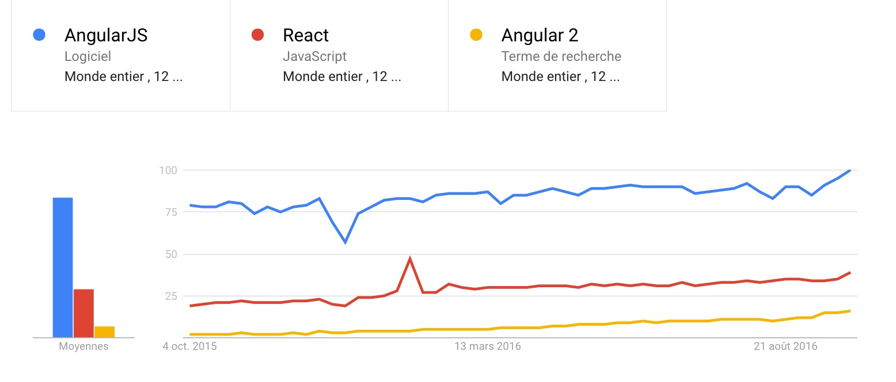
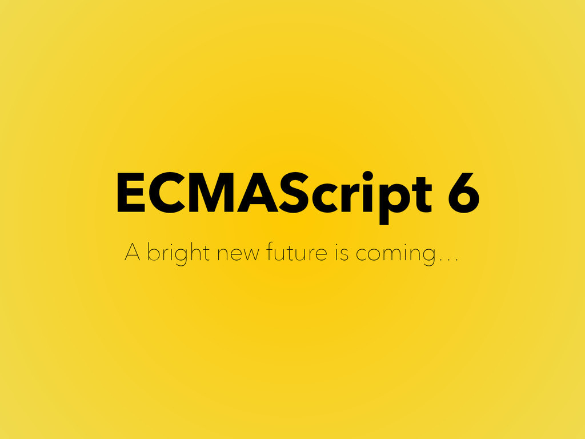

name: main-page
layout: true
class: main-page
---
## valtech_
# Angular 2

.main-container[
.main-body[
.main-logo[]]
]

---
layout: false
name: summary-page
layout: true
class: summary-page
---

.summary-container[

# 00
## Résumé


 .summary-body[
- .summary-item[01] Introduction
- .summary-item[02] ECMAScript 6
- .summary-item[03] TypeScript
- .summary-item[04] Angular2
- .summary-item[05] Outillage & Industrialisation
  ]

]

---
name: chapter-page
layout: true
class: chapter-page
---

.chapter-container[
  # 01
  ## Introduction
]

---
layout: false

.page-header[
  # 01.1
  ## Le web
]

.center.margin-top-70[

]
---
class: angular-react-bg

.page-header[
  # 01.2
  ## Les frameworks
]

.row[

 .col-lg-4[
 
   #### Angular 1
   - Google - 2009
   - Le premier framework,
   - MVVM,
   - Des controleurs, directives, services, etc...
   - Two data-binding,
   - Les tests unitaires !
 ]
  
 .col-lg-4[
   #### ReactJS
   
   - Facebook - 2013
   - Le challenger !
   - Mais seulement sur l'aspect Component,
   - DOM Shadow,
   - Performance et réactif,
   - One way data-binding,
   - Universal JavaScript.
 ]
 
 .col-lg-4[
   #### Angular 2
   - Google - 2016
   - Le renouveau ?
   - Orienté :
     - ECMAScript 6 & TypeScript,
     - Web Components,
     - Mobile First.
   - La programmation Reactive...
   - Angular Universal.
  ]

]

>.center[http://tutorials.pluralsight.com/front-end-javascript/angular-vs-react-a-side-by-side-comparison]

---

.page-header[
  # 01.3
  ## Les Tendances - Google trend
]

.center[

]


---
template: chapter-page

.chapter-container[
  # 02
  ## ECMAScript 6 
  ## ES2015
]

---

.page-header[
  # 02.1
  ## Présentation de ES6
]


.pull-left[
Publié en Juin 2015 et rénommé ES2015. Cette spécification apporte les features suivantes : 

- Scope (var, let)
- Arrow functions
- Paramètre par défaut
- Agrégation de paramètre
- Template literals (interpolation)
- Syntaxe raccourcie
- Destructuring Assignment
- Module (Export, import)
- Classe, héritage, getter/setter
- Decorator (aka Java annotation)

]

.pull-right[
  
]

.footnote[http://es6-features.org/]

???
Implémentation progressive des navigateurs

---

.page-header[
  # 02.2
  ## ES6 - Let
]

L'instruction **let** est une variable. Elle évite le hoisting ("remontée"). Sa portée est limitée au bloc.

.pull-left[
#### ES5
``` javascript
function getFullName(player) {
  if (player.isWinner) {
    var name = 'Winner ' + player.name;
    return name;
  }
  return player.name;
}

// Or

function getFullName(user) {
  var name;
  if (player.isWinner) {
    name = 'Winner ' + player.name;
    return name;
  }
  // name is still accessible here
  return player.name;
}
```

]
--
.pull-right[
#### ES6

``` javascript
function getFullName(player) {
  if (player.isWinner) {
    let name = 'Winner ' + player.name;
    return name;
  }
  // name is not accessible here
  return player.name;
}
```

>.center[Remplacera définitivement **var** à long terme !]
]

???
sinon il y a un défaut dans le code


---

.page-header[
  # 02.3
  ## ES6 - Const
]

L'instruction **const** :
- est une constante 
- porté du bloc comme let
- uniquement en get

``` javascript
const NB_PLAYERS_MAX = 6;
NB_PLAYERS_MAX = 7; // SyntaxError
```
- Update attribut de l'objet ou tableau

``` javascript
//Objet
const PLAYER = {};
PLAYER.color = 'blue'; // works
PLAYER = {color: 'blue'}; // SyntaxError
//Array
const PLAYERS = [];
PLAYERS.push({ color: 'blue' }); // works
PLAYERS = []; // SyntaxError
```

---

.page-header[
  # 02.4
  ## ES6 - Affectations déstructurées
]

.left-column[
  ### 1er raccourci
]

.right-column[
Ce nouveau raccourci permet de créer des objets :

#### ES5
``` javascript
function createPlayer() {
  let name = 'John';
  let color = 'blue';
  return { name: name, color: color };//ES5
}
```
#### ES6
``` javascript
function createPony() {
  let name = 'John';
  let color = 'blue';
  return { name, color };//ES6
}
```
>.center[Ici la propriété de l’objet = nom de la variable !]
]


---

class: thin-margin-page-header

.page-header[
  # 02.4
  ## ES6 - Affectations déstructurées
]

.left-column[
  ### 1er raccourci
  ### 2e raccourci
]

.right-column[
Il permet d'affecter des variables à partir d’objets ou de tableaux.

#### ES5
``` javascript
var httpOptions = { timeout: 2000, isCache: true };
// later
var httpTimeout = httpOptions.timeout;
var httpCache = httpOptions.isCache;
```

#### ES6
``` javascript
let httpOptions = { timeout: 2000, isCache: true };
// later
let { timeout: httpTimeout, isCache: httpCache } = httpOptions;
//OR
let { timeout, isCache } = httpOptions;
// you now have a variable named 'timeout' and 
// one named 'isCache' with correct values.
// With an array :
let timeouts = [1000, 2000, 3000];
// later
let [shortTimeout, mediumTimeout] = timeouts;
```
]

---
.page-header[
  # 02.4
  ## ES6 - Affectations déstructurées
]
.left-column[
  ### 1er raccourci
  ### 2e raccourci
  ### Conclusion
]

.right-column[
#### Dans la vrai vie

``` javascript
function randomPlayerOrder() {
  let player = { name: 'John' };
  let order = 2;
  // ...
  return { player, order };
}

let { order, player } = randomPlayerOrder();

let { player } = randomPlayerOrder();
```
]

???
Cette fonctionnalité est pratique pour déclarer plusieurs variables à partir d’un objet retourné par une fonction.

---

class: thin-margin-page-header

.page-header[
  # 02.5
  ## ES6 - Paramètres optionnels
]

.left-column[
  ### Fonction
]

.right-column[
#### ES5
``` javascript
function getPlayes(size, page) {
  size = size || 10; 
  //si l’opérande de gauche est falsy, 
  //c’est-à-dire undefined, 0, false, "",
  page = page || 1;
  // ...
  server.get(size, page);
}
```

#### ES6
``` javascript
function getPlayers(size = 10, page = 1) {
  // ...
  server.get(size, page);
}
function getPlayers(size = defaultSize(), page = 1) {
  //Can call a function
}
function getPlayers(size = defaultSize(), page = size - 1) {
  //Can use previous parameters
}
```
]

???
Maintenant 0 ou "" sont des valeurs valides, et ne seront pas remplacées par les valeurs par défaut, comme size = size || 10 l’aurait fait. C’est donc plutôt équivalent à size = size === undefined ? 10: size;

---

.page-header[
  # 02.5
  ## ES6 - Paramètres optionnels
]

.left-column[
  ### Fonction
  ### Objet
]

.right-column[
Fonctionne aussi pour les objets :
``` javascript
let { timeout = 1000 } = httpOptions;
// you now have a variable named 'timeout',
// with the value of 'httpOptions.timeout' if it exists
// or 1000 if not
```
]

---
class: col-larger

.page-header[
  # 02.6
  ## ES6 - Rest operator
]

Permet d'utiliser la liste des argusments **proprement**.

.pull-left[
#### ES5
``` javascript
function addPlayers(players) {
  for (var i = 0; i < arguments.length; i++) {
    playesInGame.push(arguments[i]);
  }
}

addPlayers('John', 'Rosa');
```
]
--
.pull-right[
#### ES6
``` javascript
function addPlayers(...players) {
  for (let player of players) {
    playersInGame.push(player);
  }
}
```
]

<div class="clearfix" style="padding-top: 30px">
<blockquote>
.center[
 *Ne pas confondre avec spread operator ("opérateur d’étalement")*
 <br />
 `let minPrice = Math.min(...[12,3,5]);`
]
</blockquote>
</div>

???
ES5: 
 Le paramètre players n’est jamais utilisé, et rien n’indique que l’on peut fournir plusieurs poneys.

ES6:
 for …​ of utilisée pour l’itération est aussi une nouveauté d’ES6. Elle permet d’être sûr de n’itérer que sur les valeurs de la collection, et non pas sur ses propriétés comme for …​ in

---
.page-header[
  # 02.7
  ## ES6 - Les Classes
]

.left-column[
  ### Constructor / toString()
]

.right-column[
``` javascript
class Player {
  constructor(color) {
    this.color = color;
  }

  toString() {
    return `${this.color} player`;
    // see that? It is another cool feature of ES6,
    // called template literals
    // we'll talk about these quickly!
  }
}

let bluePlayer = new Player('blue');
console.log(bluePlayer.toString()); // blue player
```
]

???
Les littéraux de gabarits de caractères sont délimités par des accents graves seuls (backticks) (\` \`)  et non avec des doubles ou simples quotes. Les templates de gabarits peuvent contenir des éléments de substitution (placeholders). Ceux-ci sont indiqués par le signe dollar ($) et des accolades : ${expression}. 

---
.page-header[
  # 02.7
  ## ES6 - Les Classes
]

.left-column[
  ### Constructor / toString()
  ### Static / Get & Set
]

.right-column[
``` javascript
class Player {
  static defaultMoney() {
    return 1000;
  }

  get color() {
    console.log('get color');
    return this._color;
  }

  set color(newColor) {
    console.log(`set color ${newColor}`);
    this._color = newColor;
  }
}
//...
let playerMoney = Player.defaultMoney();//Use static

let player = new Player();
player.color = 'red';// 'set color red'
console.log(player.color);
```
]


---
.page-header[
  # 02.7
  ## ES6 - Les Classes
]

.left-column[
  ### Constructor / toString()
  ### Static / Accesseurs
  ### Héritage
]

.right-column[
``` javascript
class Case {
  constructor(name) {
    this.name = name;
  }

  doSomethink(){
  	//move, stop...
  }
}
class CaseProperty extends case {
  constructor(name, price) {
    super(name);
    this.price = price;
  }
  doSomethink(){
  	//Override function
  }
}
let case = new CaseProperty('Rue de la paix', 400);
console.log(case.price); // 400
```
- Héritage ~~prototypal~~
- Héritage de classes
]

---
class: thin-margin-page-header

.page-header[
  # 02.8
  ## ES6 - Promise
]

.left-column[
  ### Principe
]

.right-column[

- Similaire à Angular 1
- Permet de gérer l'asynchone
- Plus lisible que les callbacks

#### Avec les callback
``` javascript
getUser(login, function (user) {
  getRights(user, function (rights) {
    updateMenu(rights);
  });
});
```
#### Avec les promises
``` javascript
getUser(login)
  .then(function (user) {
    return getRights(user);
  })
  .then(function (rights) {
    updateMenu(rights);
  })
```
]

---

.page-header[
  # 02.8
  ## ES6 - Promise
]

.left-column[
  ### Principe
  ### Méthodes
]

.right-column[

Expose les méthodes `then` et `catch` 

``` javascript
asynchoneFunction().then(siSucces, siRejetée);
asynchoneFunction().catch(siRejetée); //= .then(undefined, siRejetée)
```

3 états :

- Pending (en cours), 
- Fulfilled (réalisée), 
- rejected (rejetée)
]

---
.page-header[
  # 02.8
  ## ES6 - Promise
]

.left-column[
  ### Principe
  ### Méthodes
  ### Création
]

.right-column[

Exemple de contruction d'une nouvelle promise (class Promise) :

``` javascript
let getUser = function (login) {
  return new Promise(function (resolve, reject) {
    // async stuff, like fetching users from server, 
    //returning a response
    if (response.status === 200) {
      resolve(response.data);
    } else {
      reject('No user');
    }
  });
};
```
]

???
Catch permet de gérer un reject sur une chaine de promise.
Nouvelle façon d’écrire des APIs, et toutes les bibliothèques vont bientôt les utiliser.

---
.page-header[
  # 02.9
  ## ES6 - Arrow functions
]


- Arrow function `=>`,
- Utile pour les callbacks et les fonctions anonymes,
- `return` est implicite s’il n’y a pas de bloc,
- Le `this` **reste attaché** lexicalement.

.pull-left[
#### Version longue
``` javascript
getUser(login)
   .then(user => {
       console.log(user);
       return getRights(user);
   })
   .then(rights => updateMenu(rights))
```
]

.pull-right[
#### Version raccourcie
``` javascript
getUser(login)
   .then(user => getRights(user))
   .then(rights => updateMenu(rights))
```
]

???
le this reste le this de la function parent

---

.page-header[
  # 02.10
  ## ES6 - Modules
]

.pull-left[
#### API ou convention existante

- CommonJS (NodeJS) avec une **syntaxe simple**,
- RequireJS (AMD) pour le **chargement Asynchrone**

#### Objectifs ES6

- Créer une syntaxe conciliant CommonJS / AMD,
- Analyse statique du code,
- Gestion claire des dépendances cycliques
]

--

.pull-right[
Dans `game_service.js`
``` javascript
const players = [];
export function addPlayer(player) {
  // ...
}
export function start() {
  // ...
}
```
Dans `otherFile.js`
``` javascript
import { addPlayer, start } from './game_service';
// later
addPlayer(new Player('John'));
start();
```
]
.clearfix[

>.center[Fondamentale dans Angular 2]
]
???
API AMD (Asynchronous Module Definition)

---

.page-header[
  # 02.10
  ## ES6 - Modules
]

.pull-left[

#### Import

- Utilisation d'un alias avec `as`,
- Joker `*` : importe tout !

``` javascript
import * as gameService from './game_service';
//later
gameService.addPlayer(new Player('John'));
gameService.start();
```
]

.pull-right[

#### Export

- Exporter un seul élément (function, valeur ou classe) : `default`

``` javascript
// player.js
export default class Player {
}
// other_file.js
import Player from './player';
```
]

???

---

.page-header[
  # 02.11
  ## ES6 - Et les vieux navigateurs ?
]


#### Compatibilité

Tester la comptibilité ES6 : [http://kangax.github.io/compat-table/es6/](http://kangax.github.io/compat-table/es6/)

#### Transpileur

L'objectif est d'écrire en ES6 puis convertir en ES5 !

- [Traceur](https://github.com/google/traceur-compiler) by Google
- [BabelJs](https://babeljs.io/) by Sebastian McKenzie
- [TypeScript](https://www.typescriptlang.org/) by Microsoft

???

Sebastian McKenzie avait 17 ans
 
Babeljs produit un code source plus lisible que Traceur

Angular 2 était d’ailleurs transpilé avec Traceur, avant de basculer en  TypeScript

---
name: end-chapter
layout: true
class: end-chapter
---


.end-chapter-container[

.end-chapter-body[
# Conclusion

Faite du ES6 et un coup de transpileur dans votre processus de build.
]

]

---
layout: false
template: chapter-page


.chapter-container[
  # 03
  ## TypeScript
]

---
layout: false

.page-header[
  # 03.1
  ## TypeScript
]

.pull-left[

- Permet le typage de JavaScript,
- Est un projet de Microsoft (2012),
- Communauté active.

#### Côté Google

- DartJS,
- AtScript pour ajouter des annotations.


.center[]

]

--

.pull-right[

#### Après la fusion d'AtScript et TypeScript

.center[]
]

???
Avec la mise a disposition de TypeScript (open source), la version 1.5 (en 2015) contient les fonctionnalité d'AtScript, qui a été abandonné.

---
.page-header[
  # 03.1
  ## TypeScript
]

.pull-left[

#### Principes
- Extension `.ts` (par convention) ou `.tsx` pour du ReactJS,
- Compiler en JavaScript standard (ES3, ES5, ES2015),
- Support des structures CommonJS, AMD et SystemJS,
- Code généré est très lisible.

]

.pull-right[
#### Install

```Bash
npm install -g typescript
```
#### Compile
```Bash
tsc test.ts
#sous windows 7:
tsc.cmd test.ts 
```
]
---
.page-header[
  # 03.2
  ## TypeScript - Typage
]


.pull-left[
#### let variable: type;

- **Basics** : boolean, number, string, array
- **Autres** : any, Class, Enum ,Tuple, Void
- **Mix** : number | boolean


>.center[Les **basics** peuvent être définit à l'initialisation !]

]

.pull-right[
``` typescript
let isDone: boolean = false;
let name = "Toto" //name:string
let users: Array<User> = [new User()];
// Declare a tuple type
let x: [string, number];
x = ["hello", 10]; // OK

enum Color {Red, Green, Yellow};
let c: Color = Color.Green; // c = 0

function setAfk(user: User): User {
  user.status = Color.Yellow;
  return user;
}

function setOnline(user: User): void {
  user.status = Color.Green;
}
```
]
---
class: thin-margin-page-header

.page-header[
  # 03.3
  ## TypeScript - Interfaces
]

.pull-left[
#### Objectifs

- Continuer d'utiliser la nature dynamique de JavaScript,
- Décrire et typer les librairies ou frameworks JavaScript pré-existant.
]
.pull-right[
#### Exemple
``` javascript
function addPointsToScore(player, points) {
  player.score += points;
}
```
]

.clearfix[
#### Avec TypeScript
``` typescript
function addPointsToScore(player: { score: number; }, points: number): void {
  player.score += points;
}
```
]

#### Ou en la nommant
``` typescript
interface HasScore {
  score: number;
}
function addPointsToScore(player: HasScore, points: number): void {
  player.score += points;
}
```
???
L'objet player doit posséder la propriété `score`.

---

.page-header[
  # 03.4
  ## TypeScript - Paramètre optionnel
]

#### Ajouter un `?` après le paramètre optionnel


``` typescript
function addPointsToScore(player: HasScore, points?: number): void {
  points = points || 0;
  player.score += points;
}

addPointsToScore(player);
```

--
#### Ne peut avoir de valeur par défaut

``` typescript
function buildName(firstName: string, lastName = "Smith") {
    return firstName + " " + lastName;
}
let result4 = buildName("Bob", "Adams");  
// works correctly now, returns "Bob Adams"
let result1 = buildName("Bob");                  
// works correctly now, returns "Bob Smith"
let result2 = buildName("Bob", undefined);       
// still works, also returns "Bob Smith"
let result3 = buildName("Bob", "Adams", "Sr.");  
// error, too many parameters
```

---
.page-header[
  # 03.4
  ## TypeScript - Fonction en paramètre
]

.pull-left[
#### Exemple JavaScript
``` javascript
function startGame(theCase) {
  theCase.setName('Rue de la paix');
}
```
]
--

.pull-right[

#### Exercice !

*Avec tous ce que l'on vient de voir, convertissez cette fonction en version TypeScript et lancez-la.*

]

???

Utilsation de :
- interface,
- arrow functions,
- let

Run(distance) écrit juste la distance parcourue dans la console.

--

.clearfix[
#### Solution
``` typescript
interface ICase {
  setName(name: string);
}
function starGame(theCase: ICase): void {
  theCase.setName('Rue de la paix');
}

let theCase = {
  setName: (name) => logger.log(`Name case ${name}`)
};
startGame(theCase);
```
]

---

.page-header[
  # 03.5
  ## TypeScript - Les classes
]

.left-column[
    ### Principes
]

.right-column[

- Une **classe** peut implémenter une ou plusieurs interfaces,
- Une **interface** peut étendre une ou plusieurs interfaces.

``` typescript
interface ICaseProperty extends ICase, ICasePrice {}

class CaseProperty implements ICaseProperty {
  setName(name) {
    logger.log(`Name case ${name}`);
  }
  hasPrice() {
    logger.log(`This case has a price`);
    return true;
  }
}
```
]

---

.page-header[
  # 03.5
  ## TypeScript - Les classes
]

.left-column[

   ### Principes
   ### Private/Public
    
]

.right-column[

#### Définition sur l'attribut

``` typescript
class PlayerWithoutShortcut {
  public name: string;
  private money: number;

  constructor(name: string, money: number) {
    this.name = name;
    this.money = money;
  }

  getMoney() {
    logger.log(`player has ${this.money} €`);
  }
}
```

>.center[L'attribut `private` ne sera pas accessible depuis l'exterieur de la classe !]

]


---

.page-header[
  # 03.5
  ## TypeScript - Les classes
]

.left-column[

   ### Principes
   ### Private/Public
    
]

.right-column[

#### Version raccourcie

L'instruction `private` peut être définie dans le constructeur :

``` typescript
class NamedPlayer {
  constructor(public name: string, private money: number) {
  }

  getMoney() {
    logger.log(`player has ${this.money} €`);
  }
}
```
]

???
Ces raccourcis sont très pratiques et nous allons beaucoup les utiliser en Angular 2 !

---
count: false

.page-header.thin-xs[
  # 03.5
  ## TypeScript - Les classes
]

.left-column[

   ### Principes
   ### Private/Public
    
]

.right-column[

#### Attention !

- Vérification du type seulement à la compilation,
- À l'exécution...

.center[

]
]

???

Vérification à la compilation uniquement

---

.page-header[
  # 03.6
  ## TypeScript - Utiliser d’autres bibliothèques
]

.pull-left[

#### Les ambient files definition `.d.ts`

- S'utilise avec des bibliothèques externes écrites en JS,
- Permet de typer du code JavaScript via les interfaces TypeScript,
- Interface ecrite par la [communauté](http://www.nuget.org/packages?q=DefinitelyTyped),
- Ou TSD [http://definitelytyped.org/](http://definitelytyped.org/),
- Ou plus récemment l'outil [Typings](https://github.com/typings/typings) réunissant les dépôts de TSD, NPM et GIT,
- Autonome si elles sont packagées avec npm (depuis TS 1.6).
]

.pull-right[
#### Utilisation avec Typings
``` bash
npm install --global typings
typings install --save --ambient angular
```

#### Référencement

``` typescript
/// <reference path="angular.d.ts" />
angular.module(10, []); // the module name should be a string
// so when I compile, I get:
// Argument of type 'number' is not 
//assignable to parameter of type 'string'.
```
>.center[Facultatif depuis TS 1.6 !]
]

???

Exemple pour angular 1 

---
.page-header.thin-xs[
  # 03.7
  ## TypeScript - Les décorateurs
]

.left-column[

   ### Principes
    
]

.right-column[

- Ajouter pour angular 2 *(AtScript)* à TypeScript,
- Applicable à une class, attribut, fonction/méthode, paramètre,
- Préfixé par `@`,
- Est une fonction prenant différents argument suivant le context,
- Peut aussi être paramètré (factory),
- On peut créer nos propres décorateurs.

#### Exemple Angular 2
``` typescript
@Component({ selector: 'ns-home' })
class HomeComponent {

  constructor(@Optional() hello: HelloService) {
    logger.log(hello);
  }

}
```

>.center[BabelJS supporte aussi les décorateurs Angular.]

]

???
Resemble aux annotations en Java, C# et Python

Applicable partout sauf sur les construteurs mais les paramètres oui.

https://www.typescriptlang.org/docs/handbook/decorators.html

essayer TypeScript sinon repasser à ES6 avec Babel ou Traceur, ou même ES5 si tu es complètement fou

---
.page-header.thin-xs[
  # 03.7
  ## TypeScript - Les décorateurs
]

.left-column[

   ### Principes
   ### Déclaration
    
]

.right-column.margin-top-30[
``` typescript
function Log(target: any, methodName:string, descriptor:any) {
    return {
        value: (...args: any[]) => {
            
            const argsStr: string = args.join(',')
            console.log(`Call: ${methodName}(${argsStr})`);
            const result = descriptor.value(...args);
            
            if(result){
                console.log(`Return (${methodName}): `, result);
            }
            
            return result;
        }
    };
}
class GameService {
    private players: IPlayer[] = [];
    
    @Log
    getPlayers() {
        // call API
        console.log("do getPlayers");
        return this.players;
    }
}
new GameService().getPlayers();
```
]

???
tsc.cmd main.ts --experimentalDecorators

Descriptor object : https://developer.mozilla.org/fr/docs/Web/JavaScript/Reference/Objets_globaux/Object/defineProperty

The Property Descriptor will be undefined if your script target is less than ES5.

---
template: end-chapter

.end-chapter-container[

.end-chapter-body[

# ES6 + TypeScript
Maintenant Angular 2. Ready ?

.center[

]

]
]


---
template: chapter-page

.chapter-container[
  # 04
  ## Angular 2
]

---
layout: false
name: splited-page
layout: true
class: splited-page
---

.page-header[
  # 04.1
  ## Philosophie
]

.pull-left[
- Orienté composants : 
   - *Angular 1.2 : controller + template, directive,*
   - *Angular 1.5 : component*
- Web moderne avec : 
   - WebComponent,
   - ES6 mais ES5 aussi !
- Utilisation des décorateurs :
   - TypeScript, 
   - Traceur ou Babel,
- Injection de dépendance,
- Les tests,
- Toujours magique mais fonctionne de manière différente (Zone)
]

.pull-right[

``` typescript
import { Component } from '@angular/core';
import { PlayerComponent } from './components';
import { GameService } from './services';

@Component({
  selector: 'mn-game',
  template: ``,
  directives: [PlayerComponent]
})
export class GameComponent {

  game: any;

  constructor(gameService: GameService) {
    gameService
        .get()
        .then(game => this.game = game);
  }
}
```

```html
<div>
  <h2>Game</h2>
  <div>Nb players : {{ game.players.length }}</div>
  <div *ngFor="let player of game.players">
    <nn-player [player]="playe"></nn-player>
  </div>
</div>
```
]

---
layout: false

.page-header[
  # 04.2
  ## Création de notre projet Angular 2
]

.left-column[

   ### Pré-requis
    
]

.right-column[

#### Pré-requis

- Avoir Node.js v4.2+ et NPM v3+
- Installer Typescript v1.5+ et Typings de manière globale
- Ou Typescript v2 !!

```bash
npm install -g typescript typings
```

- Initialiser un projet tsc (**T**ype**S**cript **C**ompiler)

```bash
tsc --init --target es5 --sourceMap --experimentalDecorators --emitDecoratorMetadata
```

]

???

typings: The TypeScript Definition Manager.

Not work check tsc version, si elle est inférieur à 1.5 vérifier:
It turns out C:\Program Files (x86)\Microsoft SDKs\TypeScript\1.0\; was in my windows system path (I suspect Visual Studio) and so simply removing that from my path sorted the issue.

https://www.typescriptlang.org/docs/handbook/tsconfig-json.html

Depuis la version 2 de TypeScript, typings n'est plus nécessaire. Les fichiers .d.ts peuvent directement être installés via NPM.

---
.page-header[
  # 04.2
  ## Création de notre projet Angular 2
]

.left-column[

   ### Pré-requis
   ### TSConfig
    
]

.right-column[
#### Déclaration du tsconfig.json
```json
{
  "compilerOptions": {
    "target": "es5",
    "experimentalDecorators": true,
    "emitDecoratorMetadata": true,
    "sourceMap": true,
    "module": "commonjs",
    "noImplicitAny": false
  },
  "exclude": [
    "node_modules"
  ]
}
```

**Bonus :** Compilation à la sauvegarde

```bash
tsc --watch
```
]

---
.page-header[
  # 04.2
  ## Création de notre projet Angular 2
]

.left-column[

   ### Pré-requis
   ### TSConfig
   ### Installation
    
]

.right-column.margin-top-15[
#### Installation d'Angular

```bash
npm init

npm install --save @angular/core @angular/compiler @angular/common @angular/platform-browser @angular/platform-browser-dynamic rxjs@5.0.0-beta.12 reflect-metadata zone.js
```

#### Notre package.json
```json
{
  "name": "angular2",
  "dependencies": {
        "@angular/common": "2.0.0",
        "@angular/compiler": "2.0.0",
        "@angular/core": "2.0.0",
        "@angular/platform-browser": "2.0.0",
        "@angular/platform-browser-dynamic": "2.0.0",
        "core-js": "^2.4.1",
        "reflect-metadata": "^0.1.3",
        "rxjs": "5.0.0-beta.12",
        "zone.js": "^0.6.23",
  }
  ...
}
```
]
???
les différents packages @angular.

reflect-metadata, parce que nous utilisons les décorateurs.

rxjs, une bibliothèque vraiment cool appelée RxJS pour la programmation réactive. On aura un chapitre entier consacré à ce sujet.

zone.js, qui assure la plomberie pour faire tourner notre code dans des zones isolées et y détecter les changements (on y reviendra aussi plus tard).

---
.page-header[
  # 04.2
  ## Création de notre projet Angular 2
]

.left-column[

   ### Pré-requis
   ### TSConfig
   ### Installation
   ### Typings
    
]

.right-column[
#### Création du projet typings
```bash
typings init
typings install --save --global dt~core-js
```

#### Configuration du `tsconfig.json`
```json
"exclude": [
  "node_modules",
  "typings/index.d.ts",
  "typings/global"
]
```
]
???
On doit exclure les fichiers en doublons installé par typings pour l'environnement global. Dans le cas contraire, la compilation levera une erreur de type Duplicate declaration.

---

template: end-chapter

.end-chapter-container[

.end-chapter-body[

# Ready !
Il est temps de créer notre premier composant !

.center[

]

]
]

---
.page-header[
  # 04.3
  ## Notre premier composant
]

#### @Component()

- Définir le selecteur,
- Importer le core d'Angular.

>.center[ Bonne pratique : préfixer les selecteurs, suffixer le nom des fichier par type.]

<br />

```typescript
import { Component } from '@angular/core';

@Component({
  selector: 'mn-app',
  template: '<h1>My First Angular 2 App</h1>'
})
export class AppComponent {}
```


---
template: splited-page

.page-header[
  # 04.4
  ## Création du module principal
]

.pull-left[
#### @NgModule

Ne pas confondre avec les modules ES6, ce sont des modules Angular

Il y a toujours un module racine.

**@NgModule** prends plusieurs paramètres :
- `import`: importer d'autre modules Angular,
- `declarations`: déclarer les composants qui appartiennent à notre module,
- `bootstrap`: déclarer le composant racine (premier instancier)
]
.pull-right.margin-top-p30[
```typescript
import {NgModule} from '@angular/core';
import {BrowserModule} from '@angular/platform-browser';
import {AppComponent} from './app.component';

@NgModule({
    imports: [BrowserModule],
    declarations:[AppComponent],
    bootstrap:[AppComponent]
})
export class AppModule {}
```
]
???
Nous reviendrons plus tard dessus avec une section dédier pour le reste des attributs

---
.page-header[
  # 04.5
  ## Bootstrap
]

Il existe plusieurs façon de démarer angular en fonction de l'usage (server, web worker, browser...)

- Importer `@angular/platform-browser-dynamic`,
- Appel de la méthode bootstrap avec le module principale.

#### main.ts
```typescript
import {platformBrowserDynamic } from '@angular/platform-browser-dynamic'
import  {AppModule} from './app.module'

platformBrowserDynamic().bootstrapModule(AppModule).catch(e => console.log(e));
```

#### index.html
```html
<body>
  <mn-app>
    You will see me while Angular starts the app!
  </mn-app>
</body>
```

---
.page-header[
  # 04.6
  ## Gestion des scripts
]

>.center[Plus complexe mais plus puissant. Basé sur les loaders ES6, il y a plusieurs options d'outils !]

.pull-left[
 


.center[**Recommandé par Angular**]
]

.pull-right[
 


.center[**Le plus complet**]
]

???

SystemJS est un petit chargeur de modules : tu l’ajoutes (statiquement) dans ta page HTML, tu lui indiques où sont situés les modules sur le serveur, et tu charges l’un d’eux. Il déterminera automatiquement les dépendances entre les modules, et téléchargera ceux utilisés par ton application.

---
.page-header[
  # 04.7
  ## Template
]

.left-column[

### Interpolation

]

.right-column.margin-top-50[

#### Principes Angular 1

`{{ 1+2 }} / {{ a+b }} / {{ user.name }} / {{ items[index] }}`

Expressions Angular != Expressions JavaScript
 
- **Context** : Les expressions Angular sont définies dans la class du component 
- **Forgiving** : En javascript, les propriétés non définies renvoient des ReferenceError ou TypeError. Avec Angular, elles renvoient undefined ou null. 
- **No Control Flow Statements** : Avec Angular, on ne peut pas utiliser les conditions, les boucles ou les exceptions dans les expressions.
- **Filters** : Les filtres peuvent être utilisés pour formater les données à afficher.


#### Recommandations

Utiliser des expressions simples et seulement des expressions simples :
- Data binding, 
- Appels à des fonctions, 
- Comparaison à des expressions booléennes.
]

???
Concernant les expressions, l'ensemble des concepts d'angular sont repris. Attention à la notion du forgiving qui n'est vrai que pour les valeurs simple ou primitive. 
L'accès à l'attribut d'un objet non défini lève désormais une erreur cf. slide suivant.

---
.page-header[
  # 04.7
  ## Template
]

.left-column[

### Interpolation
### Nouveauté SNO

]

.right-column[
#### Nouveauté : Safe Navigation Operator
Levé d'une erreur si la propriété n'est pas accessible.

```typescript
@Component({
  selector: 'mn-app',
  // typo: users is not user!
  template: `
    <h1>Application</h1>
    <h2>Welcome {{users.name}}</h2>
  `
})
export class AppComponent {

  user: any = { name: 'Cédric' };

}
```


> Cannot read property 'name' of undefined in [{{users.name}} in PonyRacerAppComponent]
]
???
L'IDE ne detectera pas le fait que l'objet users n'existe pas dans l'expression du template. 
Angular 2 remédie à celà et lève désormais une erreur dès lors que l'objet est undefined.
Il devient donc plus facile de detecter une erreur de code d'un cas réellement fonctionnel.

---
.page-header[
  # 04.7
  ## Template
]

.left-column[

### Interpolation
### Nouveauté SNO

]

.right-column[
#### Nouveauté : Safe Navigation Operator
Et si ma propriété est asynchrone ? 

```typescript
@Component({
  selector: 'mn-app',
  // typo: users is not user!
  template: `
    <h1>Application</h1>
     <h2>Welcome {{user?.name}}</h2>
  `
})
export class AppComponent {

  user: any;

}
```
>.center[L'opérateur `?` permet de désactiver l'erreur d'interpolation.]
]

???
Cependant le cas fonctionnel où l'on charge les données depuis un webservice va aussi lever une erreur avec la précèdente expression. 
Angular 2 introduit donc l'opérateur `?` pour explicitement indiqué au framework que l'on gère bien le fait que l'objet ne soit pas définit à 
instant t de l'exécution de notre application. C'est le nouveau concept Safe Navigation Operator.

---
.page-header[
  # 04.7
  ## Template
]


.left-column[

### Interpolation
### Nouveauté SNO
### Dépendance

]

.right-column.margin-top-90[

  #### Création d'un second composant
  
  - Importer la classe dans `app.module.ts`,
  - Déclarer la dépendance dans l'attribut `declarations` du `@NgModule`,
  - Utiliser le composant dans le template.
    
```typescript
import { NgModule } from '@angular/core';
import { BrowserModule } from '@angular/platform-browser';
import BoardComponent from "../board/board.component";
import AppComponent from "../case/case.component";

@NgModule({
    imports: [BrowserModule],
    declarations: [AppComponent, BoardComponent],
    bootstrap: [AppComponent]
})
export class AppModule {}
```
   
```typescript
@Component({
    selector: "mn-app",
    template: `<div><mn-board></mn-board>`
})
export class AppComponent {}  
```    
]

---

.page-header[
  # 04.7
  ## Template
]

.left-column[

### Interpolation
### Nouveauté SNO
### Dépendance
### Le binding

]

.right-column[

#### Le binding

- Basé sur les attributs

```html
<p>{{user.name}}</p>
```

```html
<p [textContent]="user.name"></p>
```

- La fin des ng-src, ng-show, ng-hide, ng-qqc :

```html
<div [hidden]="isHidden">Hidden or not</div>
<option [selected]="isSelected" value="John">John</option>
<p [style.color]="foreground">Friendship is Magic</p>
<mn-player name="John"></ns-pony> //non dynamique
<mn-player name="{{player.fullName()}}"></mn-player>
<mn-player [name]="player.fullName()"></mn-player>
```
]
???
En Angular 2, on peut écrire dans toutes les propriétés du DOM via des attributs spéciaux sur les éléments HTML, entourés de crochets []. Ça fait bizarre au premier abord, mais en fait c’est du HTML valide (et ça m’a aussi surpris). Un nom d’attribut HTML peut commencer par n’importe quoi, à l’exception de quelques caractères comme un guillemet ", une apostrophe ', un slash /, un égal =, un espace…

---
.page-header[
  # 04.7
  ## Template
]

.left-column[

### Interpolation
### Nouveauté SNO
### Dépendance
### Le binding
### Les événements

]

.right-column[
#### Les événements
- ~~ng-click~~, ~~ng-keyup~~, ~~ng-mousemove~~...

```html
<button (click)="onButtonClick()">Click me!</button>
```

#### Ne pas confondre
L'évaluation :
```html
<component [property]="doSomething()"></component>
```
Et le binding d'évènement :
```html
<component (event)="doSomething()"></component>
```
]

---
.page-header[
  # 04.7
  ## Template
]

.left-column[

### Interpolation
### Nouveauté SNO
### Dépendance
### Le binding
### Evénements
### Variables locales
]

.right-column[

#### Variables Locales

Permet de créer une référence vers un composant :

```html
<input type="text" #name>
{{ name.value }}

<input type="text" #name>
<button (click)="name.focus()">Focus the input</button>

<google-youtube #player></google-youtube>
<button (click)="player.play()">Play!</button>
```
]

---

.page-header[
  # 04.7
  ## Template
]

.left-column[

### Nouveauté SNO
### Dépendance
### Le binding
### Evénements
### Variables locales
### Directive de structure

]

.right-column[

#### Directive de structure

- Une directive est assez proche d’un composant, mais n’a pas de template. On les utilise pour ajouter un comportement à un élément,
- S’appuient sur l’élément `<template>`,
- Celles fournies par le framework sont déjà pré-chargées (ngIf, ngSwitch, ngFor, etc...)

#### Exemple

Version longue :
```html
<template [ngIf]="races.length > 0">
  <div><h2>Races</h2></div>
</template>
```

Version courte :
```html
<div *ngIf="races.length > 0"><h2>Races</h2></div>
```

]

---
## Templates
### Syntaxe canonique
- plus verbeux
- intéressant si ton moteur de template côté serveur a du mal avec les notations [] ou ()

```html
<ns-pony [name]="pony.name"></ns-pony>
<ns-pony bind-name="pony.name"></ns-pony>

<button (click)="onButtonClick()">Click me!</button>
<button on-click="onButtonClick()">Click me!</button>

<input type="text" ref-name>
<button on-click="name.focus()">Focus the input</button>
<input type="text" #name>
<button (click)="name.focus()">Focus the input</button>
```

---
## Templates
### Résumé
- `{{}}` pour l’interpolation,
- `[]` pour le binding de propriété,
- `()` pour le binding d’événement,
- `#` pour la déclaration de variable,
- `*` pour les directives structurelles.

---
## Injection de dépendances

Inversion de contrôle:
- le développement est simplifié
- le test est simplifié avec des mock
- a configuration est simplifiée

singleton

//TODO

???
le développement est simplifié, on exprime juste ce que l’on veut, où on le veut.

le test est simplifié, en permettant de remplacer les dépendances par des versions bouchonnées.

la configuration est simplifiée, en permutant facilement différentes implémentations.


---
## Pipes

- "tuyaux" vient de l'utilisation du caractère `|`
- utilisable directement dans le html
- utilisable dans le code (injectable)
- chainable
- parametrable `:`
- json, slice, uppercase, lowercase, replace, number, percent, currency, date, async

Equivalent des filtres dans Angular 1

```html
<p>{{ players | slice:0:2 | json }}</p>
```
donnera:
```html
<p>[ { "name": "John" }, { "name": "Rosa" } ]</p>
```

---
## Pipes
### Un pipe fait maison

``` typescript
import { PipeTransform, Pipe } from '@angular/core';

@Pipe({ name: 'fromNow' })
export class FromNowPipe implements PipeTransform {
  transform(value, args) {
    // do something here
  }
}
```

---
## Programmation réactive

//TODO

---
## Directives

- Une directive est très semblable à un composant, sauf qu’elle n’a pas de template,
- La classe Component hérite de la classe Directive dans le framework
- `@Directive`
- Selecteur css :
  + element : `footer`
  + class: `.alert`
  + attribut: `[color]` avec une valeur `[color=red]`

``` typescript
@Directive({
  selector: '[color],footer.alert'
})
export class DoNothingDirective {

  constructor() {
    console.log('Do nothing directive');
  }
}

```

???
selecteur par class à éviter

Les sélecteurs CSS à base de descendants, de frères, ou d’identifiants, et les pseudo-sélecteurs (autres que :not) ne sont pas supportés.


Ne nomme pas tes sélecteurs avec un préfixe bind-, on-, let- ou ref- : ils ont une autre signification pour le parseur, car ils font partie de la syntaxe canonique des templates.

---
## Directives et les paramètres

- un binding (`=`): utiliser `[]`
- une valeur (`@`): utiliser seulement l'attribut
- besoin d'un watch: utiliser le setter `set attribut(value)`

2 façon de faire:
.pull-left[
``` typescript
@Directive({
  selector: '[loggable]',
  inputs: ['text: logText']
})
export class SimpleTextDirective {
}

```
]
.pull-right[
``` typescript
@Directive({
  selector: '[loggable]'
})
export class InputDecoratorDirective {
  @Input('logText') text: string;
}

```
]

---
template: chapter-page

.chapter-container[
  # 05
  ## Outillage 
  ## & Industrialisation
]

---

.page-header[
  # 05.1
  ## Test unitaire
]

Permet de verifier des petites portions de code de façon isolé.

.pull-left[
#### Les outils

- Jasmine, notre framework de test unitaire (BDD),
- Karma, notre runner de test :
  - Multi-browser,
  - Multi-device,
  - Automatisation,
  - Des `repporters` pour Jenkins, Travis, etc...,
  - Et des plugins pour la couverture de test !
]

.pull-right[
#### Méthodes Jasmine

- `describe()` déclare une suite de tests,
- `it()` déclare un test,
- `expect()` déclare une assertion et peut être chainé avec :
   - `toBe()`, `toBeLessThan()`, `toBeUndefined()`, etc...
   - Et leurs inverses avec `not.toBe()`, etc... 
- `beforeEach()` pour initialiser un contexte,   
- Par convention, un fichier de test => `.spec.ts`
]

???
Une astuce : si tu utilises fdescribe() au lieu de describe() alors cette seule suite de tests sera exécutée (le "f" ajouté signifie "focus"). Même chose si tu ne veux exécuter qu’un seul test : utilise fit() au lieu de it(). Si tu veux exclure un test, utilise xit(), ou xdescribe() pour une suite de tests. 
  
---

.page-header[
  # 05.2
  ## Test unitaire - Exemple
]

Notre fichier de test `pony.spec.ts` :

``` typescript
describe('Pony', () => {
  let pony: Pony;

  beforeEach(() => {
    pony = new Pony('John', 10);
  });

  it('should have a name', () => {
    expect(pony.name).toBe('John');
  });

  it('should have a speed', () => {
    expect(pony.speed).not.toBe(1);
    expect(pony.speed).toBeGreaterThan(9);
  });
});

```

---

.page-header[
  # 05.2
  ##  Test unitaire - Tester un service Angular
]

L'équipe d'Angular nous met à disposition des méthodes :
 - `inject`,
 - `addProviders` pour initialiser les dépendances,
 - `async` pour gérer les appels asynchrone.

``` typescript
import { inject, addProviders } from '@angular/core/testing';

describe('RaceService', () => {

  beforeEach(() => TestBed.configureTestingModule({
    providers: [RaceService]
  }));

  it('should return a promise of 2 races', async(inject([RaceService], service => {
    service.list().then(races => {
      expect(races.length).toBe(2);
    });
  })));
});
```

???
Async utilise la notion de Zone d'Angular

---

.page-header[
  # 05.3
  ##  Test unitaire - Mocker une dépendance
]


On déclare un faux service :

``` typescript
class FakeLocalStorage {
  get(key) {
    return [{ name: 'Lyon' }, { name: 'London' }];
  }
}
```

Puis on mock le service via `addProviders` :

``` typescript
import { addProviders, inject } from '@angular/core/testing';

describe('RaceService', () => {

  beforeEach(() => TestBed.configureTestingModule({
    providers: [
      { provide: LocalStorageService, useClass: FakeLocalStorage },
      RaceService
    ]
  }));

  it('should return 2 races from localStorage', inject([RaceService], service => {
    let races = service.list();
    expect(races.length).toBe(2);
  }));
});
```


---

.page-header[
  # 05.3
  ##  Test unitaire - Tester un composant
]

#### Pour ce faire nous aurons besoin

- D'instancier notre composant avec `TestComponentBuilder`,
- De récupérer une représentation du composant `ComponentFixture`,
- D'initialiser un contexte (Given),
- De déclencher un changement d'état `fixture.detectChange()` (When),
- Et de tester le resultat produit (Then).

#### Notre composant 

``` typescript
@Component({
  selector: 'ns-pony',
  template: ``
})
export class PlayerComponent {

  @Input() pony: PonyModel;
  @Output() ponyClicked: EventEmitter<PonyModel> = new EventEmitter<PonyModel>();

  clickOnPony() {
    this.ponyClicked.emit(this.pony);
  }

}
```

---

.page-header[
  # 05.3
  ##  Test unitaire - Tester un composant
]

#### Notre test

``` typescript
describe('RaceComponent', () => {
  let fixture: ComponentFixture<RaceComponent>;

  beforeEach(() => {
    TestBed.configureTestingModule({
      declarations: [RaceComponent, PonyComponent]
    });
    fixture = TestBed.createComponent(RaceComponent);
  });

  it('should have a name and a list of players', () => {
    // given a component instance with a race input initialized
    const raceComponent = fixture.componentInstance;
    raceComponent.race = { name: 'London', players: [{ name: 'John', color: 'BLUE' }] };

    // when we trigger the change detection
    fixture.detectChanges();

    // then we should have a name with the race name
    const element = fixture.nativeElement;
    expect(element.querySelector('h1').textContent).toBe('London');

    // and a list of players
    const players = fixture.debugElement.queryAll(By.directive(PonyComponent));
    expect(players.length).toBe(1);
    // we can check if the pony is correctly initialized
    const rainbowDash = players[0].componentInstance.pony;
    expect(rainbowDash.name).toBe('John');
  });
});
```

---

.page-header[
  # 05.2
  ## Test End to End
]


